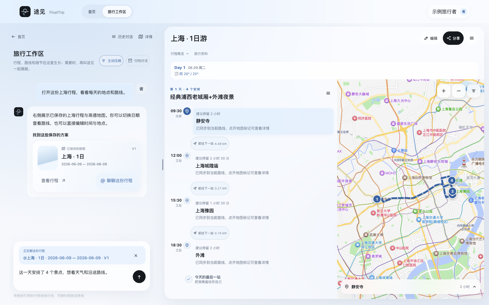
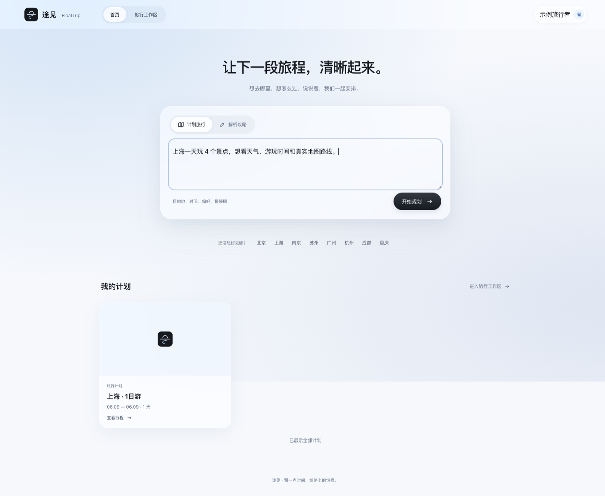
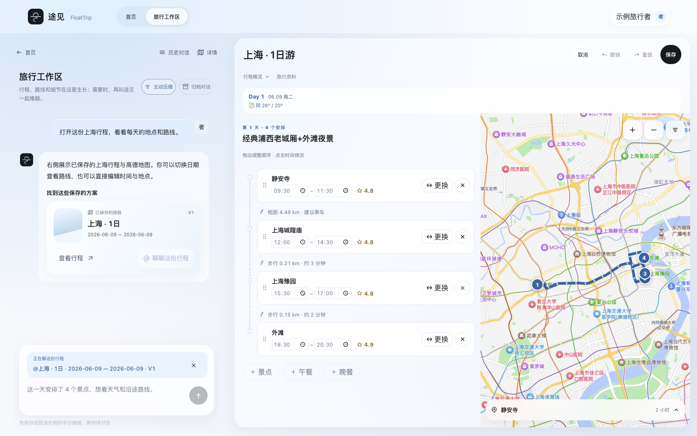
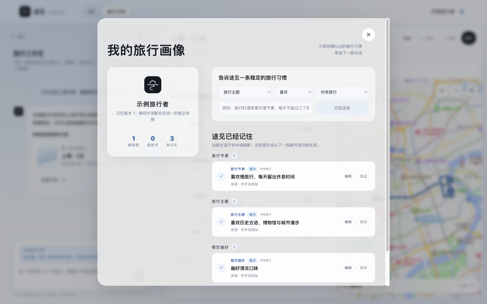
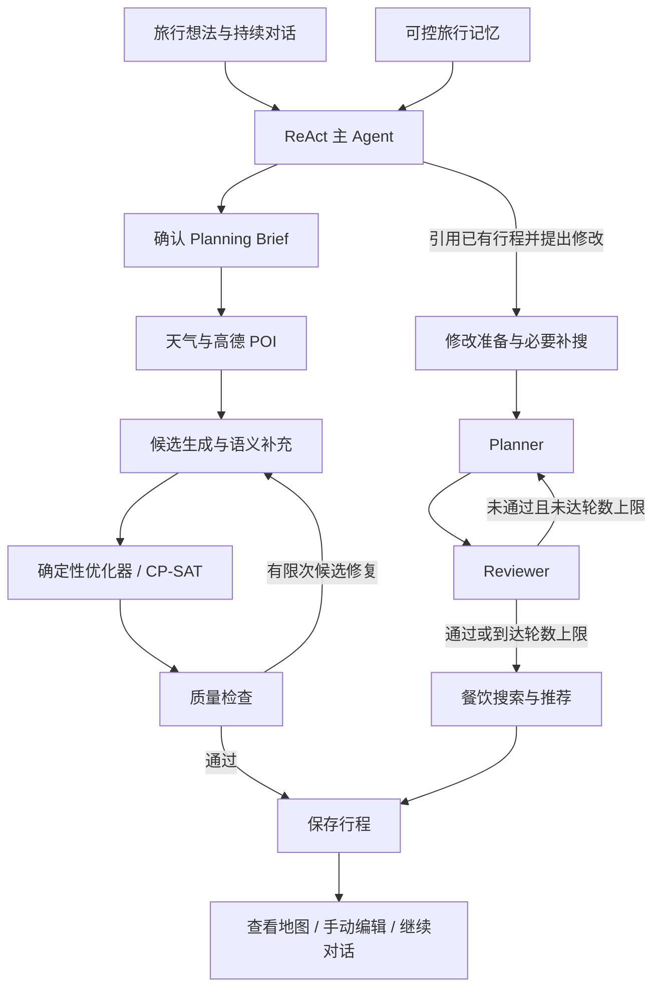

<div align="center">


# 途见 · FloatTrip

### 从一句旅行想法，到可以继续修改的逐日行程

对话 Agent 理解需求，真实 POI 提供地点依据，约束求解编排行程。<br />
在同一个工作区里讨论、查看、编辑，让旅行偏好延续到下一次出发。

[](https://fastapi.tiangolo.com/)
[](https://github.com/langchain-ai/langgraph)
[](https://react.dev/)
[](https://github.com/google/or-tools)

[功能](#features) · [界面展示](#screenshots) · [快速开始](#quick-start) · [工作原理](#architecture) · [文档](#docs)

</div>

<p align="center">
  
</p>

<p align="center"><sub>上海一日 4 个景点 · 天气、逐日安排与高德真实道路路线</sub></p>

> 上海路线图选取已保存行程中的静安寺 → 上海城隍庙 → 豫园 → 外滩，展示高德真实底图与驾车道路数据。天气为该行程保存的 **2026-06-09 历史预报：阴，20–26°C**，并非当前天气。截图使用脱敏展示数据；地图通过截图专用代理接入高德 Web 服务，详见 [截图来源](static/images/readme/web-capture-notes.md)。

<a id="features"></a>

## 能做什么

| 能力 | 使用体验 |
| --- | --- |
| **先聊清楚，再规划** | 对话补齐目的地、日期和出行约束，维护 Planning Brief；确认需求后启动规划，缺少信息时通过补充卡片继续。 |
| **记得偏好，也允许改变** | 管理长期旅行记忆，查看、编辑或忘记偏好；本次明确需求优先于历史画像。 |
| **真实地点，算法排程** | 查询高德 POI 与天气，由模型补充候选语义，再通过优化器选择、排序和安排时间，并进行质量检查。 |
| **对着已有行程继续聊** | 在输入框用 `@` 选择已保存行程，明确本次修改对象；通过对话生成行程的新版本。 |
| **直接动手调整** | 拖拽换序、更换地点、修改时段、跨日编辑、撤销与重做；保存时由服务端重算距离。 |
| **任务有进度、有记录** | Runtime 持久化任务状态和事件，支持排队、SSE 回放、取消、重试及等待用户补充。 |

Web 采用浅蓝玻璃界面。桌面端并排查看对话、路线与地图；窄屏端切换对话 / 行程、路线 / 地图，保留编辑草稿。

地点来源与排程检查提供可核对的依据；开放信息、预约要求、交通和天气仍可能变化，出发前应核实。

<a id="screenshots"></a>

## 界面展示

### 一句话开始

输入目的地、日期和偏好，从首页进入持续对话的旅行工作区。

<p align="center">
  
</p>

### 把行程改成自己的节奏

在逐日路线中直接编辑时间与地点，修改后统一保存；草稿支持撤销、重做和跨日切换。

<p align="center">
  
</p>

### 旅行记忆由你管理

偏好以可见条目呈现，可编辑、忘记或补充，无需每次重新解释。

<p align="center">
  
</p>

<a id="quick-start"></a>

## 快速开始

建议使用 **Python 3.12**。Web 由 FastAPI 直接提供，无需 Node 构建；浏览器需要能加载入口引用的 React、Babel 等 CDN 资源。

### 1. 安装

```bash
git clone https://github.com/shouzhuoshouzhuo/FloatTrip.git
cd FloatTrip
python3 -m venv .venv
source .venv/bin/activate
python -m pip install -r requirements.txt
```

Windows 下将激活命令替换为 `.venv\Scripts\activate`。

### 2. 配置

```bash
cp .env.example .env.local
```

在 `.env.local` 中填写最小配置：

```dotenv
LLM_PROVIDER=deepseek
DEEPSEEK_API_KEY=your_deepseek_key
AMAP_API_KEY=your_amap_web_service_key

# 可选：启用浏览器中的高德地图
AMAP_JS_KEY=your_amap_js_key
AMAP_JS_SECURITY_CODE=your_amap_js_security_code

# 不使用 Redis 时留空
REDIS_URL=
```

- `AMAP_API_KEY` 使用高德 **Web 服务** Key，供后端查询 POI、天气等数据。
- `AMAP_JS_KEY` 和安全密钥用于 **Web 端 JS API**；未配置时仍可查看文字行程，地图显示降级提示。
- 模型与高德调用需要你自己的服务凭据和可用额度。
- Redis 为可选缓存；模板包含本地 Redis 地址，不使用时可按上例清空。

服务凭据入口：[高德开放平台](https://lbs.amap.com/) · [DeepSeek 平台](https://platform.deepseek.com/)。

切换豆包时，配置 `LLM_PROVIDER=doubao`、`DOUBAO_API_KEY` 与服务可用的 `DOUBAO_MODEL`。`DOUBAO_API_KEY` 是 API 密钥，不是模型 endpoint ID。

完整配置项见 [环境变量模板](.env.example)；提供商配置见 [LLM_PROVIDERS.md](LLM_PROVIDERS.md)，具体默认值以模板和当前实现为准。

### 3. 启动

```bash
python run.py
```

打开 **[http://localhost:8765](http://localhost:8765)**，按页面提示注册或登录，输入旅行需求，例如：

> 10 月 16 日出发，去南京玩两天，喜欢历史和博物馆，每天不要排得太满。

聊天中确认需求后开始规划；完成后可继续对话修改，或进入行程编辑。

<a id="architecture"></a>

## 工作原理

默认对话入口使用 **ReAct 主 Agent**，负责澄清需求、维护简报和选择受控工具。新规划与修改使用不同的 LangGraph 子图：



### 模型与算法各司其职

- **主 Agent** 理解用户表达，调用记忆、简报、历史行程和规划工具。
- **Candidate Builder** 为真实 POI 补充候选语义；服务端负责绑定、过滤与兜底。
- **优化器与质量检查** 执行选点、排序、排程和独立校验，并非 LLM Agent。候选修复仍不通过时会报错，不当作成功交付。
- **Planner / Reviewer** 用于已有行程的修改。达到评审轮数上限后继续收敛，不等于评审通过。

当前新规划不走旧版 `Planner ⇄ Reviewer → Time Check` 链路；Time Check 未接入当前新规划或修改图。餐饮推荐属于修改图，不应理解为默认新规划的固定阶段。

### 任务持久化与恢复

Runtime 管理排队、并发、状态、事件、取消与重试，客户端通过 SSE 接收和回放进度。

默认 ReAct 路径中，规划 / 修改工具在当前 **Chat Run** 内执行，并不每次创建独立子 Run。主图使用 SQLite checkpoint；这不意味着每个工具内部子节点都能独立断点恢复。

当前运行时面向单节点部署。独立 Worker 路径与多节点边界见 [Runtime 文档](docs/agent-runtime.md)。

### 技术栈

| 层 | 实现 |
| --- | --- |
| API 与存储 | FastAPI、SQLite、可选 Redis |
| Agent 与任务 | LangChain、LangGraph、持久化 Runtime、SSE |
| 排程与数据 | OR-Tools CP-SAT、高德 POI 与天气 |
| 模型接入 | DeepSeek / 豆包，支持环境变量配置 |
| Web | React 18、JSX、浏览器 Babel、FastAPI 静态资源 |
| 移动端 | Bare React Native + TypeScript，复用后端 API |

<a id="docs"></a>

## 文档与开发

| 主题 | 入口 |
| --- | --- |
| 产品定位与设计取舍 | [项目介绍](docs/project-introduction.md) |
| 运行时、事件与恢复 | [Agent Runtime](docs/agent-runtime.md) |
| Web 交互与响应式行为 | [前端说明](docs/frontend-migration.md) |
| 模型与环境配置 | [提供商配置](LLM_PROVIDERS.md) · [环境模板](.env.example) |
| 评测方法与运行入口 | [评测指南](tests/EVAL_GUIDE.md) |
| 旅行质量实验 | [Benchmark 说明](tests/travel_benchmark/README.md) |
| iOS / Android 客户端 | [移动端配置与运行](mobile-app/README.md) |

**版本范围：** 本页描述当前默认路径（`CHAT_AGENT_MODE=react`、`PLANNING_VARIANT=A`）。B / C 实验变体及独立面试演示不代表默认发布能力。

评测目录包含冻结输入、确定性检查和模型评审工具。不同实验针对不同流程；旧 Planner / Reviewer 的指标不能直接作为当前默认新规划的质量结论。

### 参与贡献

欢迎提交可复现的问题、交互改进或规划质量案例：

- [提交 Issue](https://github.com/shouzhuoshouzhuo/FloatTrip/issues)：说明复现步骤、预期行为与实际结果，去除个人信息和 API Key。
- [提交 Pull Request](https://github.com/shouzhuoshouzhuo/FloatTrip/pulls)：聚焦一个问题，说明行为变化与验证方式。
- 调整 Agent 或排程逻辑时，补充对应回归用例；评测方式参考上面的指南。

如果项目对你有帮助，欢迎 [Star FloatTrip](https://github.com/shouzhuoshouzhuo/FloatTrip)。
